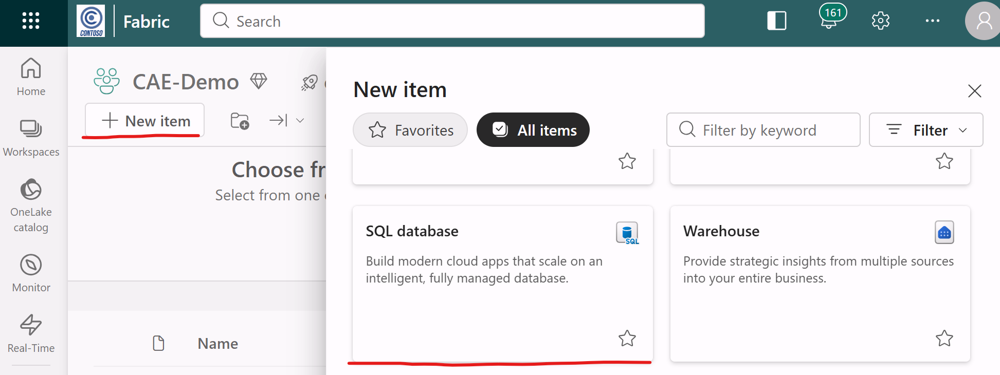
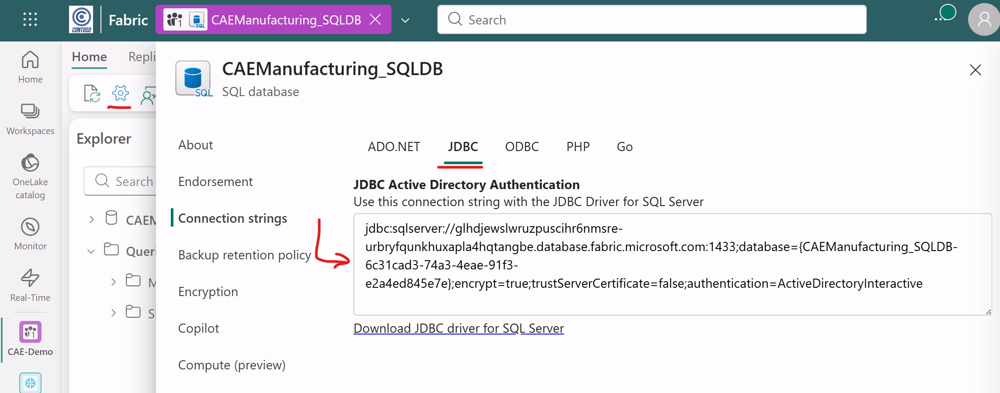
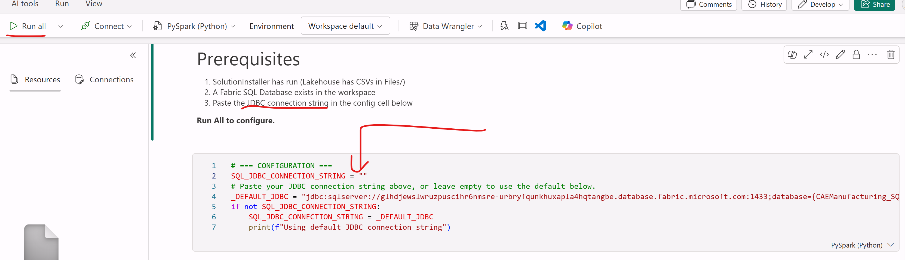

# CAE Flight Simulator Manufacturing Demo

An end-to-end **Microsoft Fabric** demo that simulates a CAE-style flight simulator manufacturing facility in Montreal. It combines real-time machine telemetry, workforce management, project scheduling, and agentic AI to demonstrate capacity optimisation across a factory floor.

## The Story

CAE builds full-flight simulators (FFS) for airlines worldwide. Each simulator is a multi-million-dollar machine assembled from precision-machined parts, hydraulic systems, avionics, visual projections, and control loading systems.

This demo models **9 concurrent simulator build projects** for customers including Air Canada, Lufthansa, Emirates, Delta, United, WestJet, Air France, Qatar Airways, and the Royal Canadian Air Force. A team of **28 technicians + 4 managers** (25 FTEs + 3 contractors) builds these simulators using **20 manufacturing machines** — CNC mills, lathes, laser cutters, welders, press brakes, CMMs, and more.

The AI agent reasons across all data sources to:
- Detect machine health issues from telemetry and schedule preventive maintenance
- Reassign workers based on skills, certifications, physical limitations, and union rules
- Optimise the project schedule when tasks slip or resources become unavailable
- Explain every decision with full reasoning

## Architecture

```
                        ┌─────────────────────────────────────────┐
                        │         Microsoft Fabric Workspace       │
                        ├─────────────────────────────────────────┤
                        │                                         │
  Manufacturing         │   ┌─────────────┐    ┌──────────────┐  │
  Machines (20)    ────►│   │ Eventstream  │───►│  Eventhouse   │  │
  Telemetry             │   │             │    │  (KQL DB)    │  │
                        │   └─────────────┘    └──────────────┘  │
  Workforce             │   ┌─────────────┐           │          │
  Clock-in/out     ────►│   │ Eventstream  │───►       │          │
  Task events           │   └─────────────┘           ▼          │
                        │                     ┌──────────────┐   │
                        │                     │  Power BI     │   │
  Reference Data        │   ┌─────────────┐   │  Dashboards   │   │
  HR, BOM, Inventory───►│   │ SQL Database │──►│  Gantt Chart  │   │
  Projects, Tasks       │   │  hr.* erp.*  │   └──────────────┘   │
                        │   │  plm.* mes.* │          │          │
                        │   └──────┬───────┘          │          │
                        │          │                  │          │
                        │          ▼                  ▼          │
                        │   ┌─────────────────────────────┐      │
                        │   │  AI Agent (Foundry)          │      │
                        │   │  Capacity Management         │      │
                        │   └─────────────────────────────┘      │
                        └─────────────────────────────────────────┘
```

## Data Stores

| Store | Schema | Tables | Purpose |
|---|---|---|---|
| **SQL Database** | `hr` | employees, skills_certifications, employee_schedules, work_restrictions, time_off, contractor_agreements, collective_agreements, machine_certifications | Workforce data with CRUD |
| **SQL Database** | `erp` | production_lines, production_line_dependencies, machines, inventory, purchase_orders, maintenance_history, contract_clauses, sensor_definitions | Production infrastructure |
| **SQL Database** | `plm` | simulators, bill_of_materials, projects, tasks, task_type_durations, part_specs, machine_capabilities | Product lifecycle management |
| **SQL Database** | `mes` | machine_jobs | Manufacturing execution |
| **Eventhouse** (KQL) | — | MachineTelemetry, ClockInEvents | Real-time event data |
| **Lakehouse** | — | CSV files in Files/ | Staging only (deployment) |

## Manufacturing Machines (20)

| ID | Type | Machine | Manufacturer | Line | Zone |
|---|---|---|---|---|---|
| CNC-001 | CNC Mill | 5-Axis CNC Milling Center | DMG MORI | PL-01 | Machining |
| CNC-002 | CNC Mill | 3-Axis CNC Milling Machine | Haas | PL-01 | Machining |
| CNC-003 | CNC Mill | 3-Axis Horizontal CNC Mill | Mazak | PL-01 | Machining |
| CNC-005 | CNC Mill | 5-Axis CNC Milling Center | DMG MORI | PL-01 | Machining |
| LTH-001 | CNC Lathe | 2-Axis CNC Turning Center | Mazak | PL-01 | Machining |
| LTH-002 | CNC Lathe | Multi-Axis CNC Turning Center | Okuma | PL-01 | Machining |
| LSR-001 | Laser Cutter | Fiber Laser Cutting System | Trumpf | PL-01 | Sheet Metal |
| LSR-002 | Laser Cutter | Fiber Laser Cutter 8kW | TRUMPF | PL-01 | Sheet Metal |
| PRB-001 | Press Brake | CNC Hydraulic Press Brake | Amada | PL-01 | Sheet Metal |
| EDM-001 | Wire EDM | Wire EDM Machine | Sodick | PL-01 | Machining |
| ADD-001 | 3D Printer | Metal Additive Manufacturing | EOS | PL-01 | Additive |
| WLD-001 | TIG Welder | Automated TIG Welding Cell | Lincoln Electric | PL-02 | Welding |
| WLD-002 | MIG Welder | Robotic MIG Welding Cell | Fanuc | PL-02 | Welding |
| CMM-001 | CMM | Coordinate Measuring Machine | Zeiss | PL-02 | Quality |
| PNT-001 | Paint Booth | Downdraft Paint Spray Booth | Global Finishing | PL-02 | Finishing |
| PNT-002 | Paint Booth | Automated Robotic Paint Booth | Durr | PL-02 | Finishing |
| CRN-001 | Overhead Crane | 50-Ton Overhead Bridge Crane | Konecranes | PL-02 | Assembly |
| HTB-001 | Hydraulic Test | Hydraulic Test Bench | Parker Hannifin | PL-02 | Test |
| ASM-001 | Electronics Assembly | Electronics Assembly Station | Juki | PL-03 | Electronics |
| RFL-001 | Reflow Oven | SMT Reflow Oven | Heller | PL-03 | Electronics |

**3 Production Lines:** PL-01 Precision Fabrication (Building A), PL-02 Assembly & Integration (Building B), PL-03 Electronics & Systems (Building C)

**107 sensors** across all machines — spindle speed/temperature/vibration, coolant flow, laser power, arc voltage, welding current, probe deflection, reflow zone temperatures, and more.

## Simulator Projects (9)

| Project | Simulator | Customer | Type | Status (Apr 22, 2026) |
|---|---|---|---|---|
| PRJ-003 | SIM-003 Boeing 777X | Emirates | Civilian | 100% Delivered |
| PRJ-001 | SIM-001 Boeing 737 MAX | Air Canada | Civilian | 84% Qualification Testing |
| PRJ-009 | SIM-009 CF-18 Hornet | Royal Canadian Air Force | Military | 45% Qualification Testing |
| PRJ-002 | SIM-002 Airbus A320neo | Lufthansa | Civilian | 30% Cockpit Integration |
| PRJ-006 | SIM-006 Boeing 737 MAX | WestJet | Civilian | 15% Hydraulics |
| PRJ-007 | SIM-007 Airbus A320neo | Air France | Civilian | 0% Planned |
| PRJ-004 | SIM-004 Airbus A350 | Delta Airlines | Civilian | 0% Planned |
| PRJ-005 | SIM-005 Boeing 787 | United Airlines | Civilian | 0% Planned |
| PRJ-008 | SIM-008 Boeing 777X | Qatar Airways | Civilian | 0% Planned |

Each project has **13 tasks** with finish-to-start dependencies, skill requirements, and a standard duration from the `task_type_durations` reference table. The Gantt structure is Power BI-compatible (Task Name, Start, Duration, % Complete, Resource).

## Workforce (28 technicians + 4 managers)

| Employee | Type | Specialty | Line | Limitation |
|---|---|---|---|---|
| Jean-Pierre Tremblay | FTE Senior | Motion Systems | PL-01 | Back — 25kg lift max |
| Marie-Claire Dubois | FTE | Hydraulics | PL-02 | — |
| Luc Bergeron | FTE Senior | Electrical | PL-03 | Knee — no ladders |
| Sophie Lavoie | FTE | Visual Systems | PL-02 | — |
| Philippe Gagnon | FTE Senior | Avionics | PL-03 | Hearing — noise restricted |
| Marc-André Pelletier | FTE Senior | Hydraulics (Night) | PL-02 | Respiratory — no chemicals |
| Catherine Morin | FTE | Electrical | PL-03 | — |
| François Côté | FTE | Motion Systems | PL-01 | — |
| David Chen | FTE | Test Engineering | PL-02 | — |
| Nathalie Bouchard | FTE | Structures | PL-02 | — |
| Miguel Lopez | FTE | CNC Machining | PL-01 | — |
| Véronique Dufresne | FTE Senior | CNC Machining | PL-01 | Vision — corrective lenses |
| Hassan Al-Farsi | FTE | Welding | PL-02 | — |
| Patrick O'Brien | FTE | Welding (Night) | PL-02 | — |
| Yuki Tanaka | FTE | Electronics | PL-03 | — |
| Samuel Martin | FTE Senior | Electronics | PL-03 | — |
| Priya Sharma | FTE | Avionics | PL-03 | — |
| Thomas Wilson | FTE | Sheet Metal | PL-01 | — |
| Mei Wong | FTE | Sheet Metal (Night) | PL-01 | — |
| Kevin Murphy | FTE | Painting | PL-02 | — |
| Aisha Mohammed | FTE | Quality | PL-02 | — |
| Roberto Silva | FTE Senior | Welding | PL-02 | Wrist — limited TIG |
| Wei Chen | FTE | CNC Machining | PL-01 | — |
| André Lefebvre | FTE | Additive Manufacturing | PL-01 | — |
| Isabelle Roy | FTE | Electronics | PL-03 | — |
| James Taylor | Contractor | Hydraulics | PL-02 | — |
| Maria Garcia | Contractor | Electrical | PL-03 | — |
| Wei Zhang | Contractor | CNC Machining | PL-01 | — |
| **Sylvie Raymond** | **Line Mgr** | **Precision Fabrication** | **PL-01** | — |
| **Robert Lapointe** | **Line Mgr** | **Assembly & Integration** | **PL-02** | — |
| **Claire Pelletier** | **Line Mgr** | **Electronics & Systems** | **PL-03** | — |
| **Marc Fortin** | **Prod Mgr** | **Manufacturing** | — | — |

## Repo Structure

```
cae-demo/
├── deploy/
│   └── SolutionInstaller.ipynb          # Import into Fabric → Run All
├── workspace/                           # Published by fabric-cicd
│   ├── GetStarted.Notebook/             # Guided walkthrough
│   ├── PostDeploymentConfig.Notebook/   # Creates SQL tables, loads data
│   ├── Data/
│   │   └── CAEManufacturing_LH.Lakehouse/       # Staging Lakehouse
│   ├── RTI/                                      # Real-Time Intelligence
│   │   ├── CAEManufacturingEH.Eventhouse/        # Telemetry store
│   │   ├── SimulatorTelemetryStream.Eventstream/ # Machine telemetry ingestion
│   │   └── ClockInEventStream.Eventstream/       # Workforce event ingestion
│   ├── Pipelines/                                # Scheduled data pipelines
│   │   ├── TelemetryPipeline.DataPipeline/       # 1-min schedule
│   │   ├── ClockInPipeline.DataPipeline/         # 1-min schedule
│   │   ├── SimulatorTelemetryEmulator.Notebook/  # Single-shot telemetry emitter
│   │   ├── ClockInEventEmulator.Notebook/        # Single-shot clock-in emitter
│   │   └── TelemetryFaultInjection.Notebook/     # Manual — CNC mill failure demo
│   └── Agent/
│       └── CapacityManagementAgent.Notebook/     # AI agent querying SQL DB
├── data/
│   ├── erp/          # production lines, machines, inventory, purchase orders, maintenance
│   ├── hr/           # employees, skills, schedules, restrictions, time off, contractors
│   ├── plm/          # simulators, BOMs, projects, tasks, part specs, machine capabilities
│   ├── mes/          # machine_jobs (MES scheduling)
│   └── telemetry/    # sensor_definitions.csv (107 sensors × 20 machines)
└── scripts/          # Local Python tools + KQL scripts
    ├── kql/                        # KQL anomaly scoring views + functions
    │   ├── machine_health_monitoring.kql
    │   ├── anomaly_scoring.kql
    │   └── dashboard_spec.json
    ├── generate_project_data.py    # Regenerate 8 projects with scheduling constraints
    ├── telemetry_normal.py         # Standalone telemetry generator
    ├── telemetry_fault_injection.py # CNC mill fault profile
    ├── clockin_events.py           # Workforce event generator
    └── validate_data.py            # Referential integrity checker
```

## Deployment

### 1. Run the SolutionInstaller

In a Fabric notebook, run these cells:

```python
# Cell 1
%pip install -q fabric-cicd azure-identity gitpython

# Cell 2
import os, shutil, tempfile, glob, requests
from git import Repo
from fabric_cicd import FabricWorkspace, publish_all_items
import notebookutils
from azure.core.credentials import AccessToken

clone_dir = os.path.join(tempfile.gettempdir(), "cae-demo-install")
if os.path.exists(clone_dir): shutil.rmtree(clone_dir)
Repo.clone_from("https://github.com/benoit-d/cae-demo.git", clone_dir, branch="master", depth=1)
workspace_dir = os.path.join(clone_dir, "workspace")
data_dir = os.path.join(clone_dir, "data")

WORKSPACE_ID = os.environ.get("TRIDENT_WORKSPACE_ID", "")
if not WORKSPACE_ID:
    try:
        ctx = notebookutils.runtime.context
        WORKSPACE_ID = ctx.get("currentWorkspaceId", "") or ctx.get("workspaceId", "")
    except: pass

TOKEN = notebookutils.credentials.getToken("https://api.fabric.microsoft.com")
class _Cred:
    def get_token(self, *s, **k): return AccessToken(TOKEN, 0)

ws = FabricWorkspace(workspace_id=WORKSPACE_ID, repository_directory=workspace_dir,
    item_type_in_scope=[
        "Notebook", "Lakehouse", "Environment",
        "Eventhouse", "Eventstream",
        "KQLDatabase", "KQLDashboard", "KQLQueryset",
        "SemanticModel", "Report", "SQLDatabase",
        "DataPipeline",
    ], token_credential=_Cred())
publish_all_items(ws)

# Cell 3 — Upload seed data to Lakehouse
headers = {"Authorization": f"Bearer {TOKEN}"}
resp = requests.get(f"https://api.fabric.microsoft.com/v1/workspaces/{WORKSPACE_ID}/items", headers=headers)
items = resp.json().get("value", [])
lh = next((i for i in items if i.get("displayName") == "CAEManufacturing_LH"), None)
if lh:
    for folder in ["erp", "hr", "telemetry", "plm", "mes"]:
        src = os.path.join(data_dir, folder)
        if not os.path.isdir(src): continue
        for f in sorted(glob.glob(os.path.join(src, "*"))):
            dest = f"abfss://{WORKSPACE_ID}@onelake.dfs.fabric.microsoft.com/{lh['id']}/Files/data/{folder}/{os.path.basename(f)}"
            notebookutils.fs.cp(f"file://{f}", dest)
    # Upload KQL scripts
    kql_src = os.path.join(clone_dir, "scripts", "kql")
    if os.path.isdir(kql_src):
        for f in sorted(glob.glob(os.path.join(kql_src, "*"))):
            dest = f"abfss://{WORKSPACE_ID}@onelake.dfs.fabric.microsoft.com/{lh['id']}/Files/scripts/kql/{os.path.basename(f)}"
            notebookutils.fs.cp(f"file://{f}", dest)

shutil.rmtree(clone_dir, ignore_errors=True)
```

> **Note:** You will see a `Parameter file not found` warning during publishing — this is expected and harmless. No parameter file is needed.

### 2. Create a Fabric SQL Database

In the workspace, click **+ New item > SQL Database** and name it `CAEManufacturing_SQLDB`.



Copy the **JDBC connection string** from SQL Database > Settings > Connection strings.



### 3. Run PostDeploymentConfig

Open the deployed `PostDeploymentConfig` notebook. Paste the JDBC connection string in the config cell. Run All.



This creates 4 schemas (`hr`, `erp`, `plm`, `mes`) with 24 tables, bulk inserts all data, then adds primary keys and foreign keys.

### 4. KQL Database Setup

The **PostDeploymentConfig** notebook automatically creates the KQL Database inside the Eventhouse via the Fabric API. It creates `MachineTelemetry` and `ClockInEvents` tables with streaming ingestion enabled.

### 5. Paste Eventstream Connection Strings

Open each Eventstream in the Fabric UI, go to **Custom App** source, and copy the connection string. Paste it into the config cell of the corresponding simulator notebook.


### 6. Configure Activator (optional)

Create a new **Reflex** item in the Fabric workspace. Connect it to the KQL Database and set it to monitor anomaly scores. Configure trigger: any row with `composite_score > threshold`. Add a Teams notification action.

### 7. Demo

- **Pipelines** stream machine telemetry and clock-in events every 1 minute (auto-scheduled)
- Run **Simulation/TelemetryFaultInjection** manually to simulate a CNC mill spindle bearing failure
- Open **Agent/CapacityManagementAgent** to see the AI reason across all sources
- Build a **Power BI Gantt chart** from `plm.projects` + `plm.tasks`


## Referential Integrity

All data has verified referential integrity:
- Employee emails link across: employees → tasks → projects → clock-in events → maintenance history
- Simulator IDs link: simulators → projects
- Machine IDs link: machines → sensor_definitions → maintenance_history → telemetry events
- Task dependencies: tasks.FS_Task_ID → tasks.Task_ID (self-referencing within project)
- Skill requirements: tasks.Skill_Requirement matches assigned employee's skills_certifications
- No employee is double-booked across concurrent tasks
- No actual dates are in the future (relative to April 21, 2026)

Run `python scripts/validate_data.py` to verify.

## Key Design Decisions

| Decision | Rationale |
|---|---|
| SQL Database for all reference/project tables | CRUD for write-back (schedule updates, task completions), DirectQuery for Power BI, agent-friendly |
| Eventhouse for telemetry + events | Sub-second queries on time-series data, native KQL |
| Lakehouse as staging only | CSVs upload there during deployment, then get loaded into SQL DB |
| Single-shot notebooks for data pipelines | No long-running Spark executors; pipeline calls notebook every 1 min |
| Constraints added after bulk insert | Avoids FK ordering issues during initial data load |
| Separate simulators (products) from machines (equipment) | Telemetry monitors manufacturing machines, not the simulators being built |

## License

This project is provided as-is for demonstration and educational purposes.
